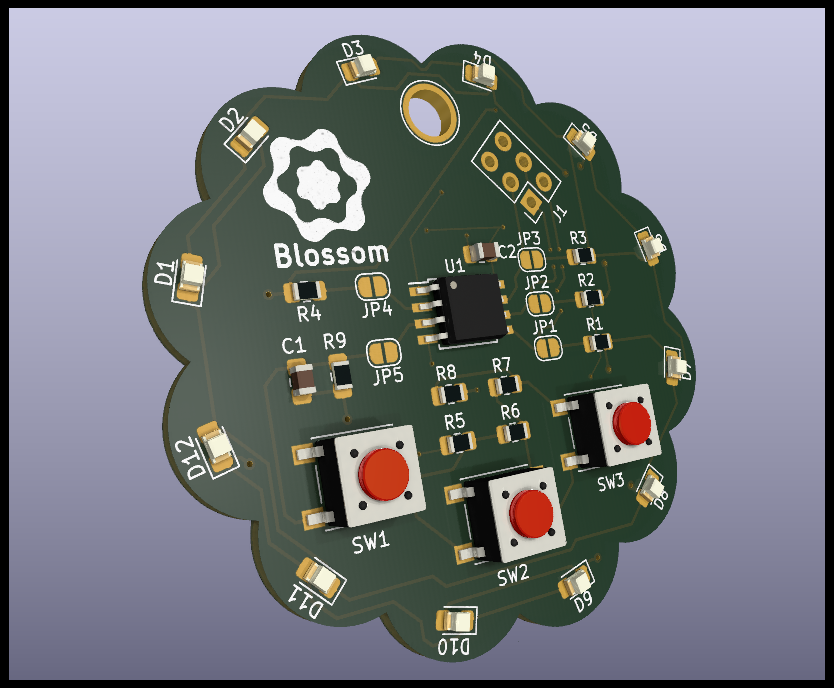

# Blossom

Blossom is my attempt at an Open Source Board designed using [KiCad 6](https://www.kicad.org/) and [OpenSCAD](https://openscad.org/). It packs 12 LEDs driven by a technique called Charlieplexing and 3 Buttons which are read using one analog pin. The board itself resembles a flower, at its heart an ATtiny85 MCU.

The firmware for the board can be found in the [blossom-firmware](https://github.com/mole99/blossom-firmware) repository.

# The KiCad Project

The project related files are placed in `kicad/`. The aim of the project was to learn a lot and besides that create a small PCB controlled by an ATtiny85 which blinks some LEDs and reads in input from three buttons.

The 12 LEDs are controlled by just 4 pins using [Charlieplexing](https://en.wikipedia.org/wiki/Charlieplexing). The current states of the 3 buttons is sampled by charging a capacitor depending on which button is pressed and reading the analog input.

# The board outline

You can find the files used to create the board outline and various positions for holes and the position of the LEDs under `cad/`.

To open the files you need to install [OpenSCAD](https://openscad.org/).

# Custom silkscreen icons

Using a tool called `svg2mod` I was able to convert a SVG icon drawn in Inkscape to a KiCad footprint module file. You can find the files in `icons/`.

You can easily do this with this command:

> svg2mod -i blossom.svg -o blossom.kicad_mod -p 0.1

where `p` stands for precision, the smaller the more precise.

# The finished PCB

(This is the 1.0 version)